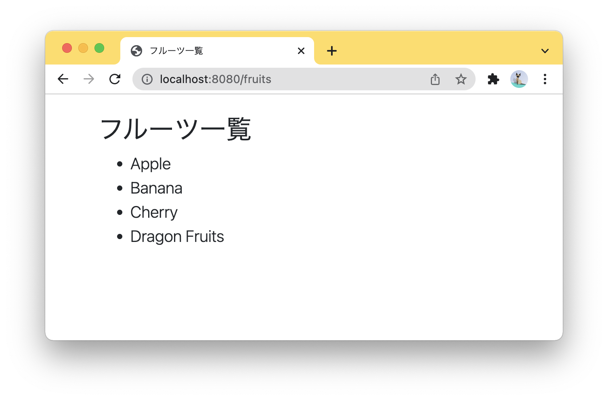
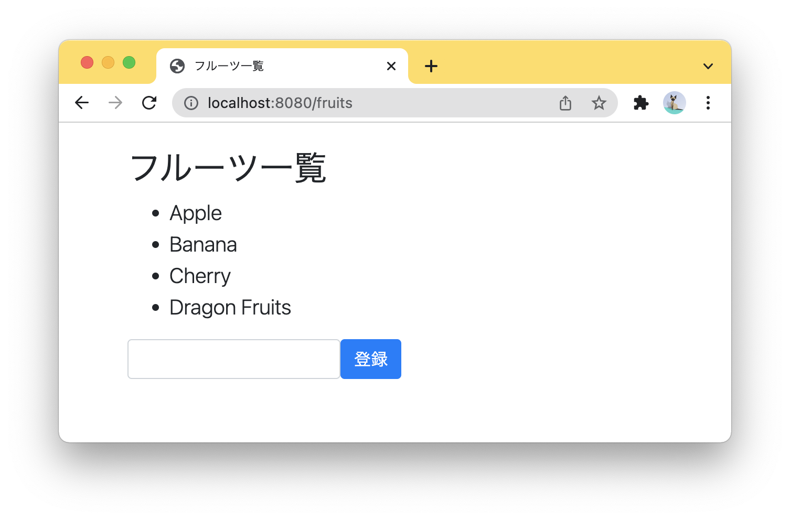

# Spring Framework 演習問題

Eclipse上で Spring Starterプロジェクト「spring-exercise」を作成して課題に取り組んでください。プロジェクト作成時には、次の依存関係（Dependencies）を追加します。

- Spring Web
- Spring Boot DevTools
- Lombok
- Thymeleaf

<br>

<br>
<hr>

### 演習1

次のリストの内容（フルーツの名前）をHTMLのリスト要素で表示しなさい。

```java
List<String> fruits = Arrays.asList("Apple", "Banana", "Cherry", "Dragon Fruits");
```



<br><br>

**com/exercise/controller/FruitController.java**

```java
package com.exercise.controller;

import java.util.Arrays;
import java.util.List;

???
public class FruitController {

    /**
     * showメソッド
     */
    ???
    public ??? show(???) {
        List<String> fruits = Arrays.asList("Apple", "Banana", "Cherry", "Dragon Fruits");
        ???
    }

}
```

<br>

**com/exercise/form/FruitForm.java**

```java
package com.exercise.form;

???
public class FruitForm {
    private String name;
}
```

<br>

**templates/fruits/list.html**

```html
<!DOCTYPE html>
<html xmlns:th="http://www.thymeleaf.org">
<head>
    <meta charset="UTF-8">
    <title>フルーツ一覧</title>
    <link rel="stylesheet" href="https://stackpath.bootstrapcdn.com/bootstrap/4.5.0/css/bootstrap.min.css">
    <script src="https://code.jquery.com/jquery-3.5.1.slim.min.js"></script>
    <script src="https://cdn.jsdelivr.net/npm/popper.js@1.16.0/dist/umd/popper.min.js"></script>
    <script src="https://stackpath.bootstrapcdn.com/bootstrap/4.5.0/js/bootstrap.min.js"></script>
</head>
<body>
    <header class="container mt-4">
        <div class="row">
            <div class="col-10">
                <h2>フルーツ一覧</h2>
            </div>
        </div>
    </header>
    <article class="container">
        <div class="row">
            <div class="col-10 lead">
                ???
            </div>
        </div>
    </article>
</body>
</html>
```

<br>
<hr>

### 演習2

リスト要素の下にテキストボックスと登録ボタンを追加し、以下の処理を実装しなさい。

- 登録ボタン押下時にFruitControllerのaddメソッドを実行する。
- FruitServiceインターフェースを実装するFruitServiceImplで「テキストボックスの入力値 + "を追加しました。"」とコンソールに表示する。
- コンソール表示後にshowメソッドにリダイレクトする。




<br>

<hr>

### 演習3

AOPで各メソッドの実行前に以下のようなログを出力しなさい。

```
INFO : String com.exercise.controller.FruitController.show(Model)
```

<br>

> ヒント：クラス名とメソッド名の取得には、JoinPointのgetSignature()メソッドが使えます。
